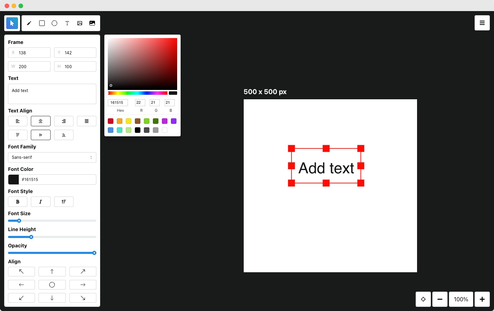

# Flatdraw

A simple canvas drawing web application with responsive UI. Built using [TypeScript](https://typescriptlang.org), [React](https://react.dev), and [Next.js](https://nextjs.org).

**Live demo:** [flatdraw.com](https://flatdraw.com)

[](https://flatdraw.com)

## Requirements

- [Node.js](https://nodejs.org) (the specific version is defined in the [`.nvmrc`](.nvmrc) file)

## Getting started

Copy the content of `.env.example` to a new `.env` file and fill in the required environment variables. You can get your Unsplash API keys [here](https://unsplash.com/developers).

```bash
cp .env.example .env
```

Install all the dependencies.

```bash
npm install
```

Run the development server.

```bash
npm run dev
```

Open [http://localhost:3000](http://localhost:3000) with your browser to see the result.

## License

Open source under the terms of the [MIT License](/LICENSE).
